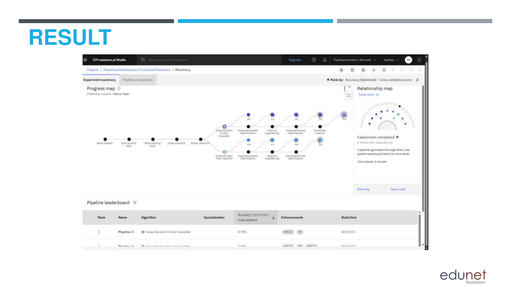
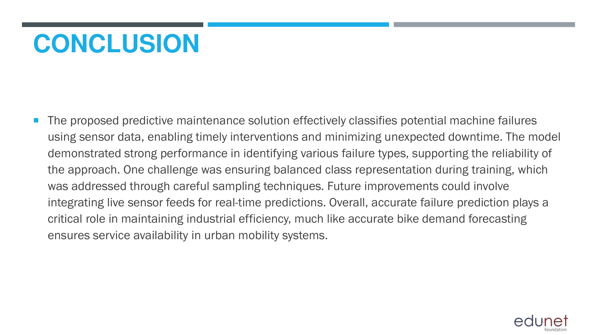

# Predictive Maintenance of Industrial Machinery using IBM Watsonx

## 📌 Project Overview
This project implements an end-to-end machine learning solution for predicting equipment failures in industrial machinery. The system analyzes historical sensor data to classify potential failure types before breakdowns occur, enabling proactive maintenance and reduced operational downtime.

The complete machine learning lifecycle — from data preprocessing to cloud deployment and inference — is implemented using **IBM Watsonx.ai** and **IBM Cloud services**.

---

## 🎯 Problem Statement
Unplanned machinery failures can cause significant production delays and financial losses in industrial environments. Traditional maintenance approaches are reactive and inefficient.

**Objective:**  
Build a multiclass classification model that predicts machine failure types based on sensor readings, enabling early intervention and preventive maintenance strategies.

---

## 🧠 Solution Approach
The solution follows a structured ML pipeline:

1. Data ingestion from a public industrial sensor dataset
2. Data cleaning and feature engineering
3. Automated model training and evaluation
4. Cloud-based model deployment
5. Real-time inference using deployed endpoints

---

## 🗂 Dataset
- **Source:** Kaggle – *Machine Predictive Maintenance Classification*  
- **Features:**  
  - Air temperature  
  - Process temperature  
  - Rotational speed  
  - Torque  
  - Tool wear  
  - Machine type  
- **Target Variable:** Failure type (multiclass)

---

## 🛠 Technologies Used
- **Platform:** IBM Cloud  
- **ML Services:**  
  - Watsonx.ai  
  - Watsonx AutoAI  
  - Watsonx Deployment Spaces  
  - Watsonx Data Refinery  
- **Storage:** IBM Cloud Object Storage  
- **ML Techniques:**  
  - Classification  
  - Feature engineering  
  - Model evaluation (Accuracy, Precision, F1-score)

---

## ⚙️ Model Training
- AutoAI was used to automatically generate, train, and evaluate multiple ML pipelines.
- Algorithms evaluated include Random Forest, Gradient Boosted Trees, and Logistic Regression.
- The best-performing pipeline was selected based on cross-validation accuracy and F1-score.

### 🔍 AutoAI Experiment Summary

### 🏆 Pipeline Leaderboard

---

## 🚀 Model Deployment
- The trained model was deployed as a **REST-based online service** using Watsonx Deployment Spaces.
- The deployment enables real-time predictions on new sensor inputs.

### 📦 Deployment Space

---

## 🔎 Inference & Prediction
- New sensor data can be provided through the Watsonx UI.
- The deployed model returns predicted failure types along with confidence scores.

### 📥 Input Data

### 📤 Prediction Results

---

## 📊 Results
- The deployed model successfully classifies machine failure types.
- High confidence predictions demonstrate the effectiveness of the selected pipeline.
- The solution validates the feasibility of cloud-based predictive maintenance systems.

---

## ✅ Conclusion
This project demonstrates a complete applied machine learning workflow using IBM Watsonx — from data preparation and model training to cloud deployment and inference. The deployed solution highlights how automated ML platforms can accelerate real-world industrial applications.

---

## 🔮 Future Enhancements
- Integration of real-time sensor streams using IoT services
- Model performance monitoring and drift detection using Watson OpenScale
- Periodic retraining with new operational data
- Edge deployment for low-latency predictions

---

## 👤 Author
**Parshant Kumar**  
Computer Science  
IBM SkillsBuild – Capstone Project

